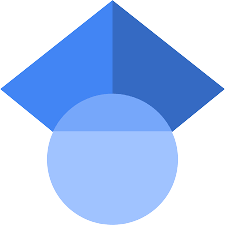

# 

<!-- # 
-->
[
 ][linkedin]
[ ][scholar]
[][Pypi]
[][ORCID]

  

<!-- 

 

    

-->

[Linkedin]:https://www.linkedin.com/in/najemeddine-abdennour/
[PyPi]:https://pypi.org/user/najem.abdennour/
[scholar]:https://scholar.google.com/citations?user=xDIajgYAAAAJ&hl=en
[ORCID]:https://orcid.org/0000-0001-9828-7318
<!--
**najemabdennour/najemabdennour** is a ✨ _special_ ✨ repository because its `README.md` (this file) appears on your GitHub profile.

Here are some ideas to get you started:

- 🔭 I’m currently working on ...
- 🌱 I’m currently learning ...
- 👯 I’m looking to collaborate on ...
- 🤔 I’m looking for help with ...
- 💬 Ask me about ...
- 📫 How to reach me: ...
- 😄 Pronouns: ...
- ⚡ Fun fact: ...
-->
